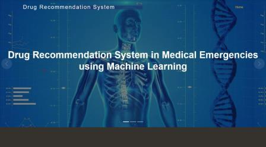

# Personalized-Medical-Recommendation-System-with-Machine-Learning
Welcome to our cutting-edge Personalized Medical Recommendation System, a powerful platform designed to assist users in understanding and managing their health. Leveraging the capabilities of machine learning, our system analyzes user-input symptoms to predict potential diseases accurately. Here's what sets our system apart:

User-Friendly Interface: Our intuitive interface allows users to input their symptoms effortlessly, creating a seamless user experience.

Advanced Machine Learning Models: We've integrated state-of-the-art machine learning models that accurately predict diseases based on input symptoms, ensuring reliable and precise results.

Tailored Recommendations: Receive personalized recommendations for the top 5 medicines, prescription details, and even workout routines based on the predicted disease.

Flask App Integration: The entire system is powered by a Flask web application, making it easily accessible to users. Experience the convenience of accessing healthcare recommendations from anywhere.

Privacy and Security: We prioritize user privacy and data security. Your health information is handled with the utmost confidentiality, adhering to the highest industry standards.

Continuous Improvement: Our system is designed for continuous improvement. As we gather more data, the machine learning models evolve, providing increasingly accurate and relevant recommendations.

Take charge of your health with our Personalized Medical Recommendation System. Your well-being is our priority, and we're dedicated to providing you with the tools and insights you need for a healthier, happier life.

 

## Features
Below is the features are highly affected by the selection of the diseases.

- diseases_list		:list of different types of diseases.
- symptoms_dict		:list of body symptoms
- diets		       	:Provide the description of diets according to the diseases.
- Medication			:Recommend the possible medicine according to disease.
- Workout		       :recommend the workout according to disease.


## Installation
```bash
  Pip install requrement.txt
```
```bash
asttokens==2.4.1
blinker==1.8.2
click==8.1.7
colorama==0.4.6
comm==0.2.2
debugpy==1.8.5
decorator==5.1.1
exceptiongroup==1.2.2
executing==2.0.1
Flask==3.0.3
importlib_metadata==8.2.0
ipykernel==6.29.5
ipython==8.18.1
itsdangerous==2.2.0
jedi==0.19.1
Jinja2==3.1.4
joblib==1.4.2
jupyter_client==8.6.2
jupyter_core==5.7.2
MarkupSafe==2.1.5
matplotlib-inline==0.1.7
nest-asyncio==1.6.0
numpy==2.0.1
packaging==24.1
pandas==2.2.2
parso==0.8.4
platformdirs==4.2.2
prompt_toolkit==3.0.47
psutil==6.0.0
pure_eval==0.2.3
Pygments==2.18.0
python-dateutil==2.9.0.post0
pytz==2024.1
pyzmq==26.1.0
scikit-learn==1.5.1
scipy==1.13.1
six==1.16.0
stack-data==0.6.3
threadpoolctl==3.5.0
tornado==6.4.1
traitlets==5.14.3
typing_extensions==4.12.2
tzdata==2024.1
wcwidth==0.2.13
Werkzeug==3.0.3
zipp==3.20.0

```
## Deployment

To deploy this project on [render](https://dashboard.render.com/)

```bash
  npm run gunicorn app:app
```


## Demo

Below is the domo for created application


## Live demo
Below is the link for live demo

[https://rice-production-analysis.onrender.com](https://medicine-recomendation-system.onrender.com/)


## Learning Objective
The following points were the objective of the project . If you are looking for all the following points in this repo then i have not covered all in this repo. I'm working on blog about this mini project and I'll update the link of blog about all the points in details later . (The main intention was to create an end-to-end ML project.)

- Data gathering
- Descriptive Analysis
- Data Visualizations
- Data Preprocessing
- Data Modelling
- Model Evaluation
- Model Deployment
.
## Usage/Examples

```javascript
app=Flask(__name__)

@app.route('/')
def page():
    return render_template('index.html')

if __name__=='__main__':
    app.run(debug=True)
```
## Dockerfile
```javascript
FROM python:3.9
COPY . /app
WORKDIR /app
RUN pip install -r requirements.txt
CMD python main.py
```


## Environment Variables

To run this project, you will need to add the following environment variables to your .env file

`API_KEY`

`ANOTHER_API_KEY`


## Installation

Install my-project with npm

```bash
  npm install my-project
  cd my-project
```
    

# Hi, I'm Ganesh! 👋


## 🚀 About Me
I am Completed post graduation in statistics with verious takenincal skills and 2+ year of experiance in data science domain. This project i create on self learning.


## 🛠 Skills
R, spss, Python, Flask, ML, DL, NLP, Render, MySQL, PowerBI, Excel, MLOps, Docker, GenrativeAI, Forcasting etc.


## Feedback

If you have any feedback, please reach out to us at dhanawadeganesh386@gmail.com


## 🔗 Links
[](https://github.com/Ganeshdhanawade/Data-Science-Portfolio)
[](https://www.linkedin.com/in/ganesh-dhanawade-47653b201?lipi=urn%3Ali%3Apage%3Ad_flagship3_profile_view_base_contact_details%3BzQkwQvdBRCyb0AhsyHF%2BdQ%3D%3D)


